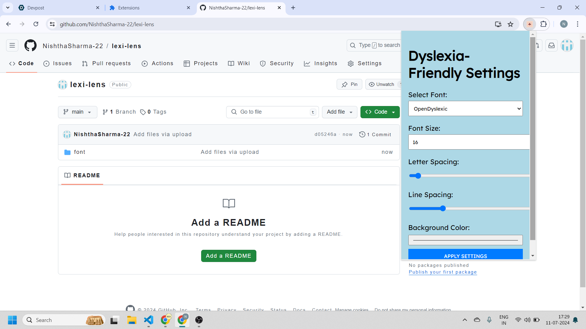
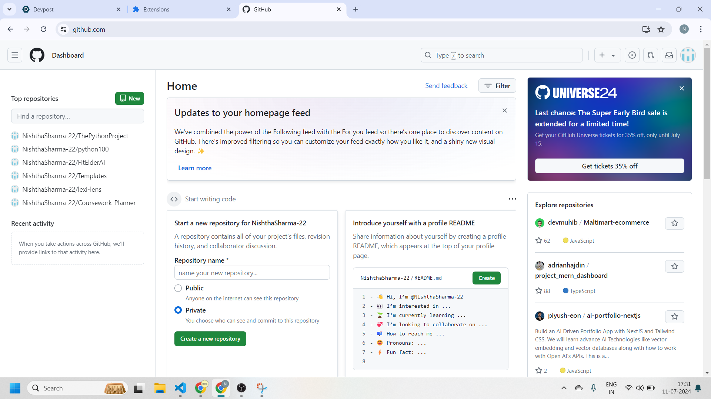
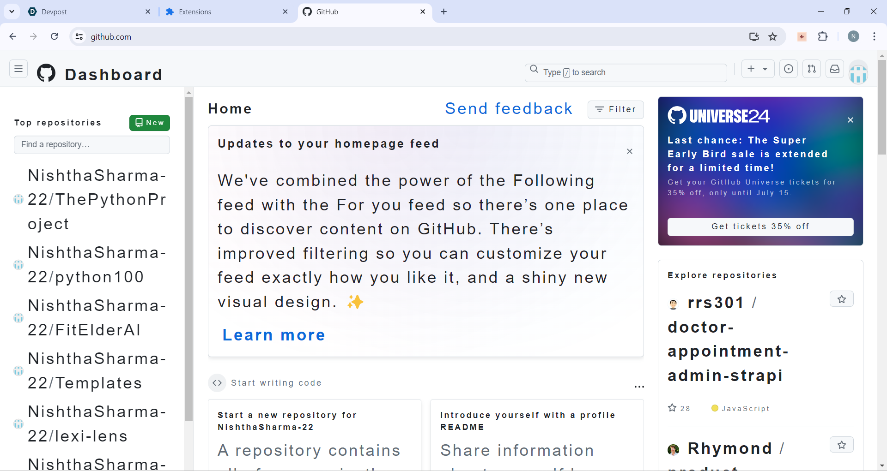

# LexiLens


**LexiLens** is a Chrome extension designed to make online reading more accessible for people with dyslexia. With features like dyslexia-friendly fonts, customizable text settings, and a read-aloud function, LexiLens aims to improve readability and comprehension for users with dyslexia.


## Table of Contents

- [Inspiration](#inspiration)
- [What It Does](#what-it-does)
- [How It Was Built](#how-it-was-built)
- [Challenges Encountered](#challenges-encountered)
- [Pride in Accomplishments](#pride-in-accomplishments)
- [What Was Learned](#what-was-learned)
- [Future Plans for LexiLens](#future-plans-for-lexilens)
- [Features](#features)
- [Screenshots](#screenshots)
- [Installation](#installation)
- [Usage](#usage)
- [Contributing](#contributing)
- [License](#license)

## Inspiration

**LexiLens** was created to address the difficulties faced by dyslexic readers. Traditional text formats on the web can be overwhelming, so this extension provides tools to adjust fonts, colors, and text spacing for a more comfortable reading experience.

## What It Does

**LexiLens** offers several features to enhance online reading:

- **Dyslexia-Friendly Fonts**: Choose from OpenDyslexic or Lexend fonts.
- **Customizable Text Colors**: Adjust text and background colors for better contrast.
- **Text Size and Spacing**: Modify font size, line height, and letter spacing.
- **Read Aloud Feature**: Have the text on the page read out loud.

## How It Was Built

**LexiLens** was developed using HTML, CSS, and JavaScript. The extension utilizes the Chrome API to modify web page content and settings. The following technologies and tools were used:

- **Languages**: JavaScript, HTML, CSS
- **Frameworks**: None (Vanilla JavaScript)
- **Tools**: Chrome Developer Tools, Visual Studio Code
- **APIs**: [Google Fonts API](https://fonts.google.com/) for dyslexia-friendly fonts
- **Libraries**: [ResponsiveVoice](https://responsivevoice.org/) for the read-aloud feature

## Challenges Encountered

One challenge was ensuring that text modifications applied consistently across different websites. Another challenge was implementing the read-aloud feature and creating a user-friendly interface for the settings.

## Pride in Accomplishments

I am proud of creating a tool that helps dyslexic readers with customizable text settings and a read-aloud feature. Successfully integrating these features into a single extension was a significant achievement.

## What Was Learned

This project provided valuable experience in developing a Chrome extension and working with APIs. I learned about creating accessible web tools and improving user interfaces for diverse needs.

## Future Plans for LexiLens

Future plans for **LexiLens** include adding more dyslexia-friendly features, such as additional font options, advanced text-to-speech capabilities, and user profiles for saving settings.

## Features

- **Dyslexia-Friendly Fonts**: Choose from OpenDyslexic or Lexend.
- **Customizable Text Colors**: Adjust text and background colors.
- **Text Size and Spacing**: Modify font size, line height, and letter spacing.
- **Read Aloud Feature**: Listen to the text on the page.
- **Font and Color Preview**: Preview changes before applying.

## Screenshots

### Before LexiLens


### After LexiLens


## Installation

To install **LexiLens** locally, follow these steps:

1. Clone this repository:
    ```bash
    git clone https://github.com/your-username/LexiLens.git
    ```

2. Open Chrome and navigate to `chrome://extensions/`.

3. Enable **Developer mode** by toggling the switch in the top right corner.

4. Click on **Load unpacked** and select the directory where the `manifest.json` file is located.

5. **LexiLens** should now be installed and visible in your extensions list.

## Usage

1. Click on the **LexiLens** icon in the Chrome toolbar.
2. Use the settings in the popup to choose a dyslexia-friendly font, adjust text colors, and change text spacing.
3. Click **Apply Changes** to see the adjustments on the current web page.
4. Use the **Read Aloud** button to have the text read to you.

## Contributing

While contributions are not currently being accepted, you can report bugs or suggest features by opening an issue on [GitHub](https://github.com/your-username/LexiLens/issues).

## License

This project is licensed under the MIT License. See the [LICENSE](LICENSE) file for more details.

---

**Feel free to reach out with questions or feedback, and thank you for checking out LexiLens!**

