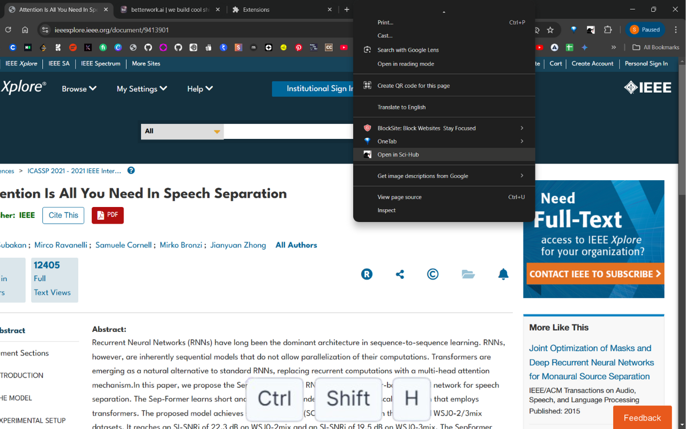

# Open in Sci-Hub 
> devTool - a chromium browser based extension
 

A devTool that allows users to quickly open research paper URLs in Sci-Hub directly from their browser with a right-click context menu, a browser action icon, or a hotkey. You can customize the Sci-Hub domain and toggle settings such as enabling/disabling hotkeys and icon clicks.

## Features

- **Open in Sci-Hub**: Quickly open any research paper URL in Sci-Hub.
- **Right-Click Context Menu**: Right-click on a link, selection, or the page itself and select "Open in Sci-Hub".
- **Icon Click**: Open the current page directly in Sci-Hub by clicking the extension icon.
- **Keyboard Shortcut**: Use `Ctrl+Shift+H` to open the current page in Sci-Hub.
- **Settings Page**: Customize the extension behavior such as enabling/disabling hotkeys, icon clicks, and setting your preferred Sci-Hub domain.
- **Dark Mode**: Toggle dark mode for the extension's options page for a better user experience.

## Installation

1. Download project zipped file (Open-in-Si-Hub.zip) ~ https://dub.sh/open-in-sh/release
2. Open Chrome and go to `chrome://extensions/`.
3. Enable **Developer mode** .
4. Click **Load unpacked** and select the folder where the project files are located.
5. The extension should now be installed and visible in your extension toolbar.

## Ways to use ~

1. **Right-click on a link**: Right-click on any link pointing to a research paper, and select **"Open in Sci-Hub"** to open the link in Sci-Hub.
2. **Right-click anywhere on the page**: Right-click anywhere on the page and select **"Open in Sci-Hub"** to open the current page in Sci-Hub.
3. **Click the Extension Icon**: Click the extension icon to open the current page in Sci-Hub.
4. **Keyboard Shortcut**: Press `Ctrl+Shift+H` (or your configured hotkey) to open the current page in Sci-Hub.

## options-menu

You can customize the extension's behavior by accessing the **Options** page.

- **Enable/Disable Icon Click**: Toggle whether clicking the extension icon opens the page in Sci-Hub.
- **Enable/Disable Hotkey**: Toggle whether pressing `Ctrl+Shift+H` (or your chosen hotkey) opens the page in Sci-Hub.
- **Sci-Hub Domain**: Set the default Sci-Hub domain (e.g., `https://www.sci-hub.wf/`).
- **Dark Mode**: Enable or disable dark mode for the options page.

### Sci-Hub Domain Preference

The extension allows you to specify a custom Sci-Hub domain (e.g., `https://www.sci-hub.wf/`). This setting is synced across all your devices.

---

## Contributing

If you would like to contribute to the project, feel free to fork the repository, make improvements, and submit a pull request.

## License

This project is open-source and available under the [MIT License](LICENSE).

## Acknowledgments

- Sci-Hub for providing free access to research papers.
- Chrome Extensions API for allowing us to build this extension.

---

If this extension has been helpful to you in any way, feel free to support me with a coffee! 
 

