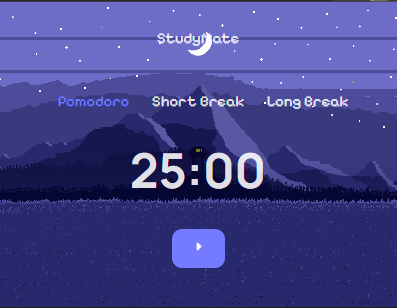
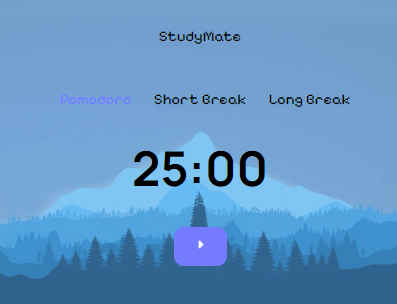

# StudyMate
*Need a little help with studying? Always get distracted way too easily? StudyMate's got you covered.* 

Proudly powered ⚡ by  `[WXT](https://wxt.dev) and  [Svelte](https://svelte.dev).

Made with ❤️ for  [High Seas](https://highseas.hackclub.com), a collaboration between GitHub and Hack Club for teenagers to build projects and get free stuff.

## Features
Currently, the app is in development. Right now, there's a cute little pixel art pomodoro timer with the features to switch from timer and track the amount of finished timers.

_Coming soon 👀_: User settings, an option to block websites, a logo (of course!) a parrot which randomly blurts out motivational quotes(?) -- enough reason to stay tuned!
**Note:** My friend Froxcey will do the art, and since he got a lot of papers to finish, the art-related things won't be in it before Christmas. _What nice of a Christmas present! 🎄✨_

## Demo video
<video width="600" controls src="https://github.com/user-attachments/assets/ec602e22-f3ec-4e99-9080-dabb993cc5f2" type="video/mp4">
    Your browser does not support the video tag.
</video>

## A few screenshots

## How do *I* use this?
If you're a developer, you can zip the extension with `pnpm zip`. <!-- If you have no idea what that means, please continue. -->

<!-- ### Installing through a ZIP file
1. At the "releases" tab, there's a ZIP file for every new StudyMate release. Choose Firefox or Chrome dependent on which browser you use.
2. _(Chrome only)_ Unzip the file.
3.  - _(Chrome)_ Click on the three dots ansd click on Extensions. Next, click on Manage extensions.
    - _(Firefox)_ Click on the three horizontal lines and click on Add-ons and themes. Then, in the left sidebar, click on "extensions".
4.  - _(Chrome)_ Switch the slider on that says Developer Mode.
    - _(Firefox)_ Click on the cog wheel. Click "Debug Add-ons".
5.  - _(Chrome)_ Click on "Load unpacked extension". Then, click on your unzipped folder.
    - _(Firefox)_ Click on "Load temporary extension". Then, click on your ZIP file.

**Enjoy!** Please note that on Firefox, the extension is only temporary since it isn't signed yet. When you really want to start using it, you have to download it from their store.

### Installing from the store
This isn't yet possible, sorry. -->

## Acknowledgements
- Sound: FreeSound.org
- Art:
    - Backgrounds: [Mountain Dusk by Ansimuz](https://ansimuz.itch.io/mountain-dusk-parallax-background) and [Winter Landscape by Chelaphynx](https://www.deviantart.com/chelaphynx/gallery)
    - Icons by [Icons8](https://icons8.com)
<!--- Logo and other assets: Froxcey -->
